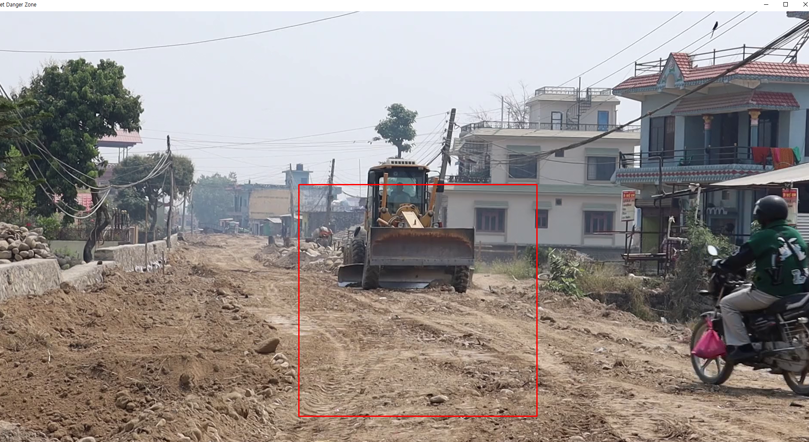
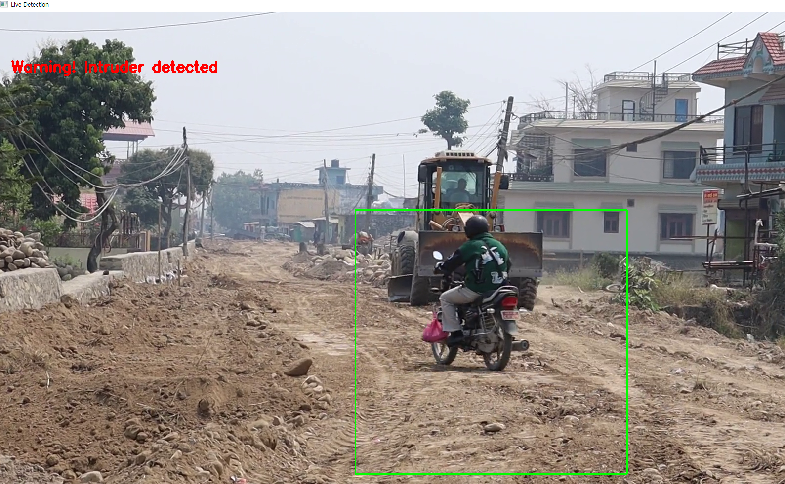
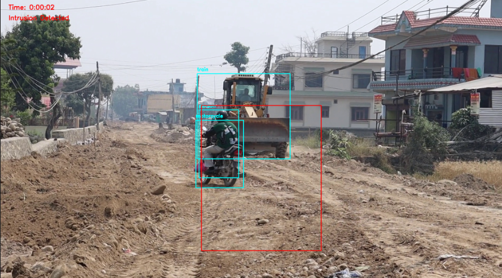
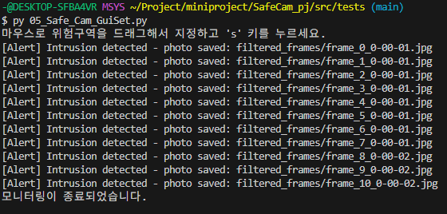

작업장 내 위험구역 침입 감지 시스템
---
## 프로젝트 개요
본 프로젝트는 CCTV 영상 기반으로 작업장 내 지정된 위험구역에 사람이 침입할 경우 이를 실시간으로 탐지하여 경고하고, 침입 순간의 영상 프레임을 자동 저장하여 사후 확인이 가능하도록 하는 시스템입니다.

---
## 목표
- 실시간 탐지 및 경고 메시지 출력
- 위험구역 드래그 설정 기능 제공
- 탐지 시 해당 프레임 이미지 자동 저장 및 로그 기록

## 사용 기술
- Python: 메인 개발 언어  
- OpenCV: 영상 처리 및 GUI(마우스 드래그) 구현  
- Ultralytics YOLOv8: 객체 탐지 모델  
- Roboflow: 커스텀 데이터셋 학습 도구 

---
## 설치 및 실행 방법
1. 필요한 라이브러리 설치  
   ```bash
   pip install ultralytics opencv-python
   ```
  
2. YOLOv8 모델 파일(yolov8n.pt)과 분석할 비디오 파일(dd.mp4)을 프로젝트 루트에 준비합니다.

3. 아래 명령어로 프로그램을 실행합니다.
   ```bash
   python 01_SafeCam.py
   ```


4. 실행 후 나타나는 GUI 창에서 마우스로 위험구역을 드래그하고, 's' 키를 눌러 설정을 완료합니다.


5. 실시간으로 영상 분석이 이루어지며, 침입 감지 시 경고 메시지 출력과 함께 해당 프레임 이미지가 자동 저장됩니다.


6. 종료는 ESC 키를 눌러 진행합니다.

---
## 프로젝트 진행 기록

<details>
<summary>08.13(수)</summary>  

#### 관련제품 (링크)
[한화비전](https://www.hanwhavision.com/ko/products/camera/network/bullet/qno-c8013r/)

#### 한계점
작업장 내 위험구역(중장비)에서 사람 인식을 잘 못하여 위험함

#### 개선점
opencv, tensorflow, yolo로 cctv 영상에서 사람을 탐지하는 기술을 활용하여 개선함.

#### 15분간 실제 제품 사용
- 제품 : Hanwha Vision
- 체험 방식 : 데모 영상 및 제품 설명, 데모 UI 확인 (지금 cctv를 사용해볼 수 있는 방법이 없음)

#### 불편한 점
- "위험 구역" 별도 설정 시 고가의 전용 솔루션이 필요함
- 실시간 탐지된 결과를 로그로 저장하거나, 영상 다운로드 기능이 없는 경우 많음
- 탐지 정확도와 상관없이 경고 알림이 너무 자주 울림 (과잉 경고 → 무시하게 됨)
기록 : 위험구역을 드래그해서 설정하는 게 왜 이렇게 어려운 거지?

#### 경쟁사 제품 사용
- 제품 : Camzify AI
- 차이점 : 탐지 이벤트를 자동으로 녹화하고, 클립을 분류해서 저장하는 시스템 (설명서 확인)

#### 사용자 리뷰 스캔
(제품 리뷰 사이트 확인 해보니)
1. 탐지를 정확하게 하지 못한다(그림자, 장비, 작은 동작도 사람으로 탐지됨)
2. 위험구역 설정이 어렵다(일반 사용자가 설정하거나 수정하기 어려움)
3. 탐지후 영상 자동 저장이 없다(상황이 지나가면 기록이 남지 않아 문제 추적 불가)
- 기록 : 현장 관리자들이 설정하는 데 어려움을 겪는다


#### 가장 짜증나는 것
- 위험구역에 사람이 침입했을 때, 그 순간의 영상이 자동 저장되지 않아 사후 확인이 어렵다.
  -> 경고는 잘 울리는데, 기록으로 남지 않으면 의미가 없다.

#### 1시간 안에 테스트 가능한 것
- mp4파일 불러와서 위에 기술들을 사용해 인식하고 영상을 저장
</details>

<details>
<summary>08.14(목)</summary> 

## 진행상황
- [피드백 진행완료](feedback/0814.md)

#### 하드웨어
- 데스크탑

#### 핵심 기능 최소 구현:
MP4 파일에서 화면 중앙 사각형 영역에 사람이 들어오면 그 프레임을 이미지로 저장하기


#### 변환 논리:
---
CCTV 실시간 영상 → 준비된 MP4 파일 1개
드래그로 위험구역 설정 → 화면 중앙 고정 사각형
YOLOv8 + Roboflow 커스텀 모델 → OpenCV 움직임 감지만
영상 클립 자동 저장 → 스크린샷 1장 저장
실시간 탐지 + 로그 → 콘솔에 "침입 감지!" 출력
사후 확인 시스템 → 저장된 이미지 폴더 확인
</details>

<details>
<summary>08.18(월)</summary>

## 진행상황

- [피드백 진행완료](feedback/0818.md)

- 저장되는 이미지에 시간 확인 기능 추가
- yolo로그 출력 메시지 차단
</details>

<details>
<summary>08.19(화)</summary>

## 진행상황

- [피드백 진행완료](feedback/0819.md)

- GUI창 띄워서 마우스 드래그로 위험구역 설정
- 실시간 경고 기능 추가
- 저장된 객체의 정보 박스 추가
</details>

<details>
<summary>08.20(수)</summary>

## 진행상황

- [피드백 진행완료](feedback/0820.md)

</details>

<details>
<summary>08.21(목)</summary>

## 진행상황

- [피드백 진행완료](feedback/0821.md)

- 하드코딩 제거
- 변수명 정리

</details>

---
## 프로젝트 폴더 구조 예시
   ```bash
   assets/              # 문서 및 이미지 자료
   docs/                # 프로젝트 문서 및 피드백 기록
   src/                 # 소스 코드
   final/             # 최종 버전 코드 및 문서
   prototypes/        # 프로토타입 관련 코드 및 문서
   tests/             # 테스트 결과 및 저장된 이미지
   README.md            # 프로젝트 설명서 (본 파일)
   yolov8n.pt           # YOLOv8 모델 가중치 파일
   dd.mp4               # 테스트용 CCTV 영상 파일
``` 

---
## 결과 확인 방법
- 침입 감지 시 저장된 이미지 파일은 src/tests/filtered_frames 폴더에서 확인할 수 있습니다.



- 탐지 이벤트는 콘솔에 실시간으로 출력됩니다.

